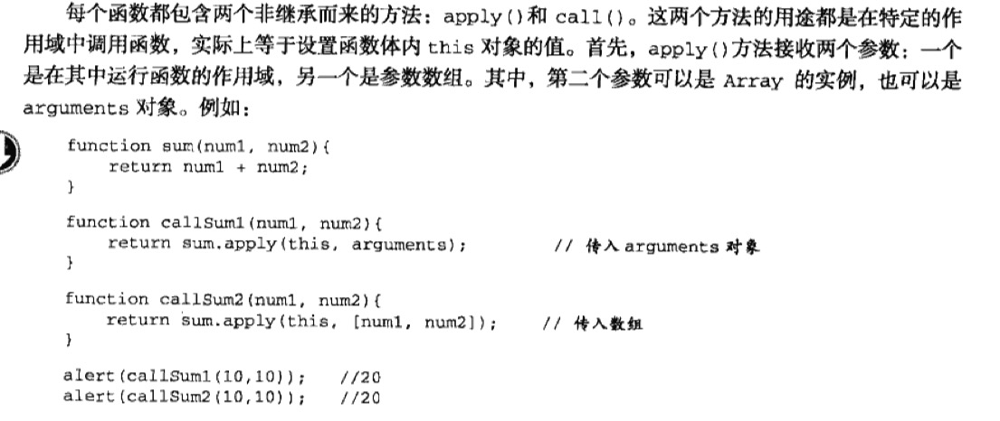
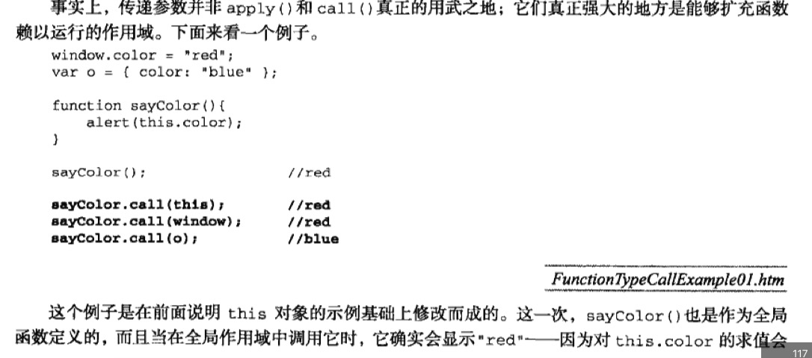
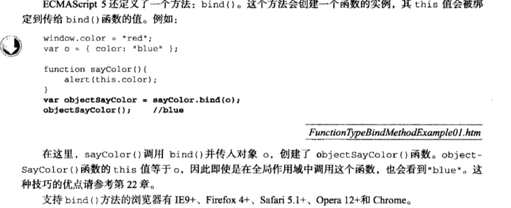

### Function类型

- JS的函数没有重载的概念，如果出现两个同名函数，第二次出现的将会覆盖第一次出现的功能

- JS的解析器会优先读取函数声明，使其在执行前可用；函数表达式只有在运行时才可用，不能提前使用；

- 函数可以作为参数，也可以作为返回值

- arguments.callee 指向拥有这个arguments对象的函数

```
ex.阶乘函数
function factorial(num) {
    if (num <=1) {
        return 1;
    }else {
        return num * arguments.callee(num-1);
    }
}
```

- 函数的属性和方法

`length`表示参数个数 

```
apply(this, [arg1, arg2...])
apply(this, arguments) 
```


```
call(this, arg1, arg2...)
```

```
bind()
```



